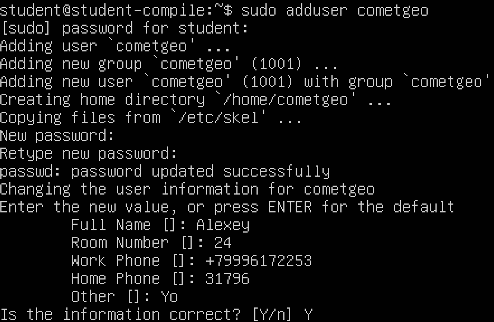
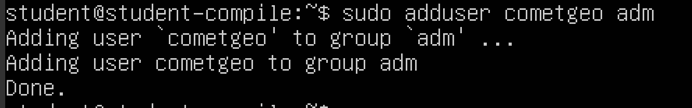
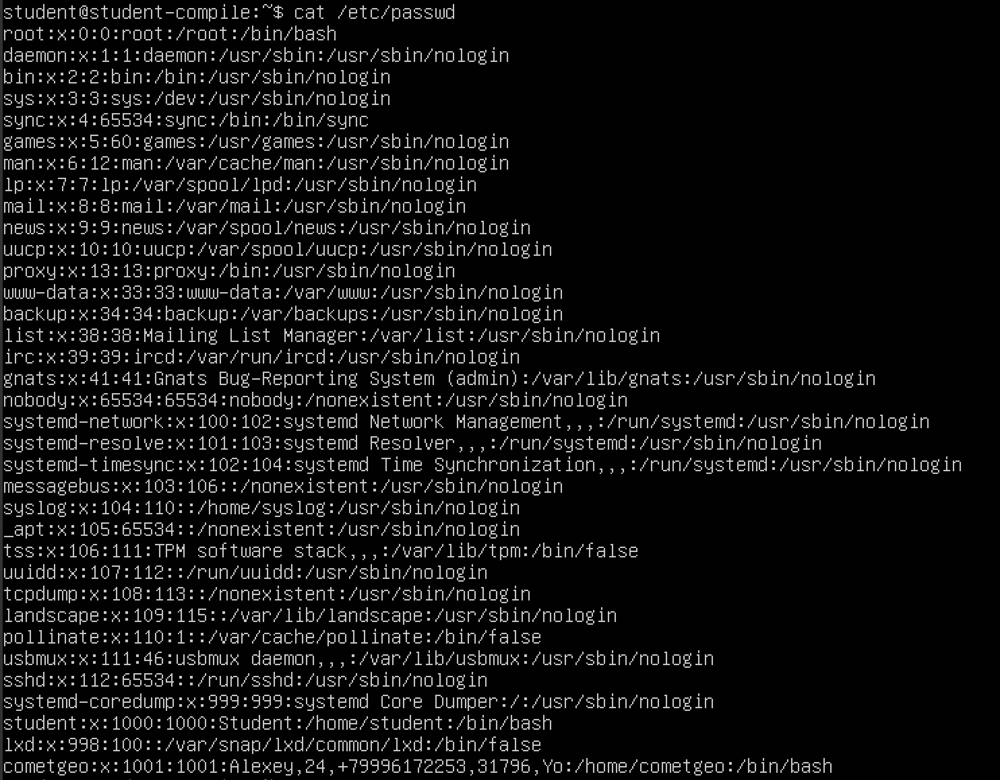

## Part 1. Installation of the OS
+ ``Ubuntu version``  

## Part 2. Creating a user
- ``Create a user``  
  
---
- ``Added to adm group``  
  
---
- ``cat /etc/passwd``  

## Part 3. Настройка сети ОС
- ``Set the machine name as user-1``  
  
---
- ``Set the time zone corresponding to your current location``  
  
---
- ``names of the network interfaces``  
  
---
- ``lo - Это внутренний адрес, который направляет обратно в локальную систему.``  
---    
- ``get the ip address from the DHCP server``
 
---
``DHCP - Dynamic Host Configuration Protocol``
---
- ``gateway (ip)``  

---
- ``internal IP address of the gateway, aka default ip address (gw)``  
  
---
- ``Set static (manually set, not received from DHCP server) ip, gw, dns settings (use public DNS servers, e.g. 1.1.1.1 or 8.8.8.8)``  

  
---
- ``заданные настройки соответсвуют``  
 
---
- ``Ping 1.1.1.1 & ya.ru``  

## Part 4. OS Update
- `обновили системные пакеты`
---

## Part 5. Using the sudo command
- ``Команда sudo предоставляет возможность пользователям выполнять команды от имени суперпользователя root, либо других пользователей``
---
- `Разрешили созданному пользователю использовать команду sudo, переключились на него и изменили имя хоста`

## Part 6. Installing and configuring the time service
- `Устанавливаем пакет синхронизации времени`
---

- `Добавляем задание в планировщик crontab -e и добавляем туда строку: @daily /usr/sbin/ntpdate pool.ntp.org`
-  `Теперь раз в сутки время само синхронизируется.`
---

## Part 7. Installing and using text editors
- `VIM text_vim.txt вышел из режима insert с помощью ESC, сохранил изменения и вышел с помощью команды :wq`
---

---
- `NANO text_nano.txt для сохранения ^O, для выхода ^X`
---

---
- `JOE text_joe.txt для сохранения и выхода нажал клавиши ^KQ`
---

---
- `VIM вышел без сохранения с помощью команды :q!`
---

---
- `NANO вышел без сохранения с помощью коммнад ^X -> N`
---

---
- `JOE вышел без сохранения с помощью коммнад ^C -> y`
---

---
- `VIM для поиска /что_ищем`
---

---
- `VIM для замены :s/что_меняем/на_что_меняем`
---

---
 - `NANO для поиска: ^W -> что_ищем`
---

---
- `NANO для замены: ^\ -> что_меняем -> на_что_меняем -> Y`
---

--- 
- `JOE для поиска: ^K F -> что ищем -> I`
---

---
- `JOE для замены: ^K F -> что_меняем -> R -> на_что_меняем -> Y`
---

---
## Part 8. Installing and basic setup of the SSHD service
 - `Установка службы sshd`  

---
- `Добавляем сервис в автозагрузку с помощью команды sudo systemctl enable sshd`  
---
- `Перенастроил службу SSHd на порт 2022`  

---
- `команда ps`  
ps - выводит сведения о процессах в статическом виде  
-e - позволяет выбрать все процессы  
| grep sshd - поиск по выводу через пайп  

---

- `перезагрука системы reboot`
- `netstat -tan`
---

---
- `-a - Показывать состояние всех сокетов; обычно сокеты, используемые серверными процессами, не показываются`  
- `-n - Показывать сетевые адреса как числа. netstat обычно показывает адреса как символы`  
- `-t - Отображать TCP подключения`  
- `Proto - Содержит тип протокола`  
- `Recv-Q - Счётчик байтов не скопированных программой пользователя из этого сокета`  
- `Send-Q - Счётчик байтов, не подтверждённых удалённым узлом`  
- `Local Address - Адрес и номер порта локального конца сокета`  
- `Foreign Address - Адрес и номер порта удалённого конца сокета`  
- `State - Состояние сокета`  
- `LISTEN Сокет ожидает входящих подключений`  
- `0.0.0.0 - это немаршрутизируемый адрес IPv4, который используется в качестве адреса по умолчанию или адреса-заполнителя`
## Part 9. Installing and using the top, htop utilities
- `uptime: 33min`
- `number of authorised users: 1 user`
- `total system load: 0.00, 0.00, 0.00`
- `total number of processes: 106 total`
- `cpu load: 0.0 us, 0.2 sy, 0.0 ni, 100.0 id, 0.0 wa, 0.0 hi, 0.0 si, 0.0 st`
- `memory load: 964.9 total, 251.4 free, 189.7 used, 523.8 buff/cache`
- `pid of the process with the highest memory usage: PID 938`
- `pid of the process taking the most CPU time: PID 938`
---
- `sorted by PID`

- `sorted by PERCENT_CPU`

- `sorted by PERCENT_MEM`

- `sorted by TIME`

- `filtered for sshd process`

- `with the syslog process`

- `with hostname, clock and uptime`
- 
## Part 10. Using the fdisk utility
- `Disk /dev/sda: 16 Gib, 17179869184 bytes, 33554432 sectors`

- `size of swap`

## Part 11. Using the df utility
- `команда df /`
---
- `размер раздела 16400252 bytes`
- `размер занятого пространства 6406540 bytes`
- `размер свободного пространства 9138624 bytes`
- `процент использования 42%`
---
- `команда df -Th /`
- `размер раздела 16G`
- `размер занятого пространства 6.2G`
- `размер свободного пространства 8.8G`
- `процент использования 42%`
- `тип файловой системы ext4`
## Part 12. Using the du utility
- `/home`

---
- `/var`

---
- `/var/log`

---
- `/var/log/*`

## Part 13. Installing and using the ncdu utility
- `Установка ncdu`

---
- `/home`

---
- `/var`

---
- `/var/log`

## Part 14. Working with system logs
- `время последней успешной авторизации, имя пользователя и метод входа в систему`

---
- `Перезапуск службы SSHd`

---
## Part 15. Using the CRON job scheduler
- `Добавляем в планировщик заданий команду uptime через каждые 2 минуты`  

---
- `uptime каждые 2 минуты`  

---
- `список задач`  

---
- `Удалил все задания из планировщика заданий`  
